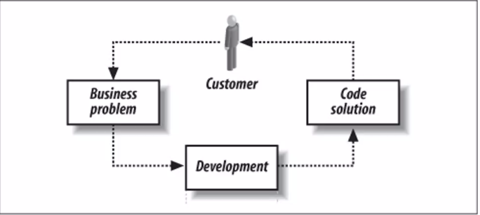
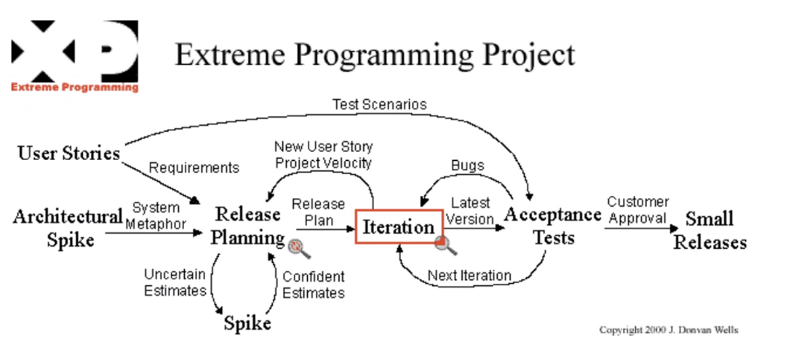
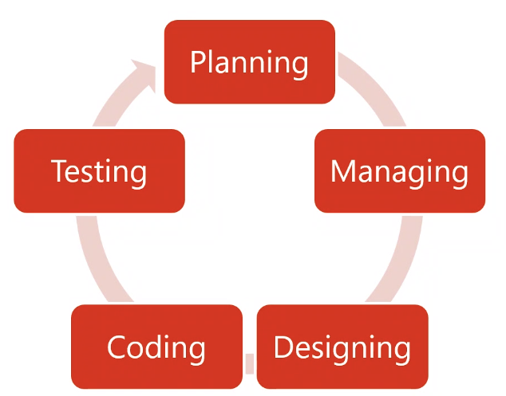
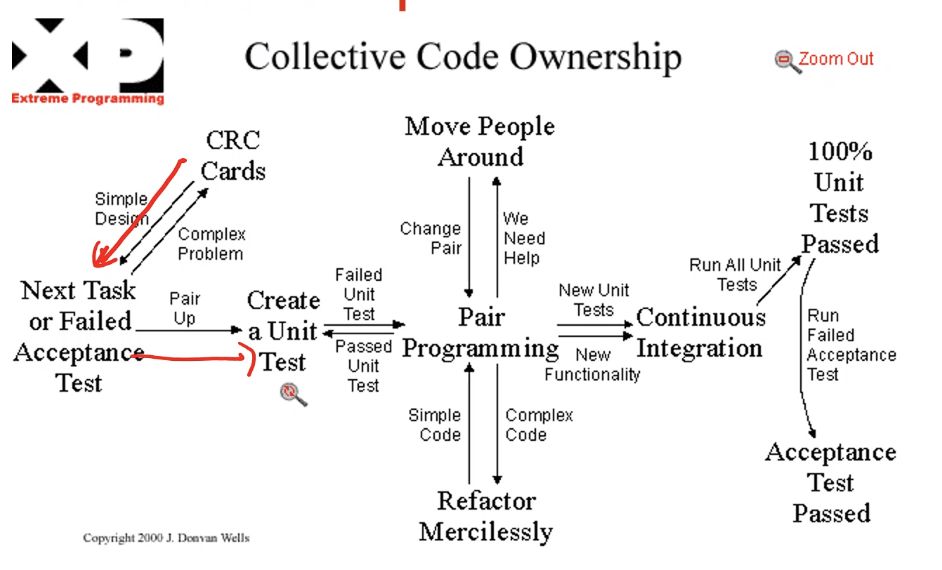

# Extreme Programming (XP)
Kuliah by Ridi Ferdiana

Improving process what has already worked to an extreme level, find the good process and redo that process more.

Extreme is a part of the agile process.
- Iterative
- Incremental

## XP values
- SImplicity,
  - **YAGNI** You are not gonna need it
  - **KISS** Keep it simple
- Communication, by including as if they are part of the team. \
	- Communicate frequently with the customer (can be everyday).
	- Invite customers into your office.
- Feedback, in the end of each iteration
- Respect, you should respect your developers (i.e. giving them human working hours) and respect your customers (i.e. hearing complains, changing specifications)
- Courage, i.e. say the honest statements to developer and customer.

## XP Practices
**User story**
- informal user's requirements/point of view. 
- User story can be simple, so keep it simple.
- Minification of the use case in UML.

**Spike solution** 
- Rough explanation.
- Simple way to explain your software to the customer, i.e. mock up, diagram, etc.
- It can be presented to the customer in the earlier stage or on each of iteration in order to illustrate final product of your work/iteration.

**System metaphor**
- Use of non-technical language to the customers to make them understand.
- The goal is to explain the idea, not the language itself.

**Release planning**
- Activity to create small release

**Small release**
- Contains user stories inside a time box.
- Small release can be multiple iterations.

**Iteration **
- Milestone that you can share your working solution.

**Unit test** 
- Doing some test in the level of method/function
- Tests are done by developers.

**Acceptance test** 
- Doing some tests in the level of user story, tests are done by tester, as the gateway between customer and developer. 
- Developer can guide the customer, if there is no tester.

**Pair programming** 
- Building codes togethers. 
- https://martinfowler.com/articles/on-pair-programming.html
- One person act as a driver (coder), another person act as a navigator (see code, evaluate, and suggest improvement)

## XP Life Cycle

- SImplicity,
  - **YAGNI** You are not gonna need it
  - **KISS** Keep it simple
- Communication, by including a

IImplementation of XP Iteration

## Planning Game
Or planning activities.
XP has strong involvement of the customer into the planning process. No strict instructions about the planning, however usually most of them look as following:

Step 1: Creation or selection of the story, create certain user story or select it from his list.

Step 2: Story estimation, estimate the story in accordance with the criteria of time and costs required for its realization.

Step 3: Prioritization of stories, based on requirements to the final product.

Step 4: The process is repeated, after one story is estimated and prioritized in the project's plan process is repeated until the plan is completed.

**After planning game**
Project manager will ask the customer " What is the priority of certain user story"
1. Essentially needed: pri 1
2. Giving business value: pri 2
3. Nice to have: pri 3

***Example***
Customer has 20 user stories with budget of $1000, and requests 20 days period.
These points are assigned by the developer based on the complexity.
Us1 = 5 point
Us2 = 5 point
Us3 = 10 point
...
Us20 = 20 point

Totals of Us is 100 point
The value=
Us1 = 5/100 \* $1000 = $50
Us1 = 5/100 \* $1000 = $50
Us3 = 10/100 \* $1000 = $100

Discussion
Look for the duration of each point, i.e. 
each point need 0.5 day work. 0.5 \* 100 = 50 days.

Now what? 
Decide based on options below
1. Hire new developers to reduce the duration of each point.
2. Creating some releases, i.e. R1 is 20 days (40 points), R2 is 20 days (40 points), R3 is 10 days (20 points).

## Planning Poker
Agile's consensus based estimation and plan.

The product owner or customer reads an agile user story or describes a feature to the estimators. Each estimators is holding a deck of Planning Poker cards with values, 0, 1, 2, 3, 5, 8, 13, 20, 40, and 100 (the values represent the number of story points, ideal days, or other units in which the team estimates).

The estimators discuss the feature, asking question of the product owner as needed. When the feature has been fully discussed, each estimator privately selects one card to represent his/her estimate. All cards are then revealed at the same time.

The poker planning process is repeated until consensus is achieved or until the estimators decide that they need additional information.

## Managing
- Open work space for working
- Sustainable pace on iteration
- Standup meeting
- Project velocity
- Work-life-balance on XP, i.e. 25 hours per week no more than that.

## Designing
- CRC cards (Class Responsibility Collaborator), brainstorming tool used in the design of object-oriented software. Partitioned into:
	- On top of the card: the class name
	- On the left: the responsibilities of the class
	- On the right, collaborators (other classess) with which this class interacts to fulfill its responsibilities.
- Spike solution
- Refactoring
	- Systematic process of improving code without creating new functionality that can transform a mess into clean code and simple design.
	- Clean code is obvious for other programmers, no duplication, contains a minimal number of classes and other moving parts, and passes all tests.
- Metaphor

## Coding
- Visible customer
- Follow coding convention
- Unit test first (test driven development)
	- Test on methods, code, or features
- Integrate frequently (CI)
- Collective Ownership

## Conclusion
