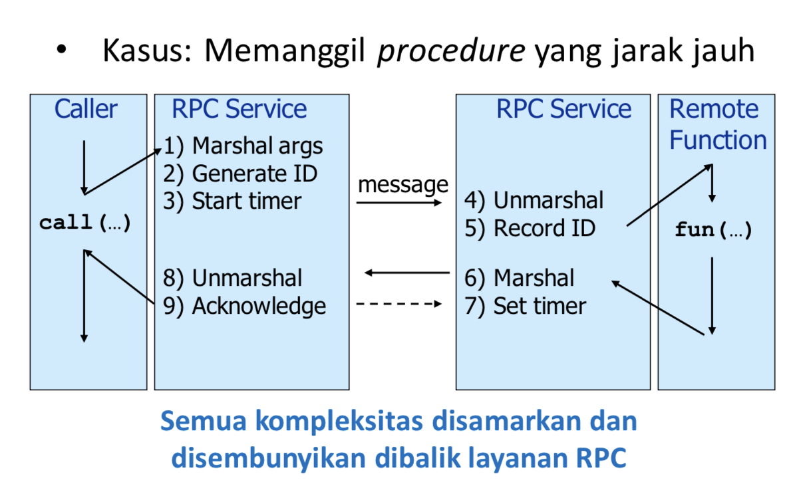
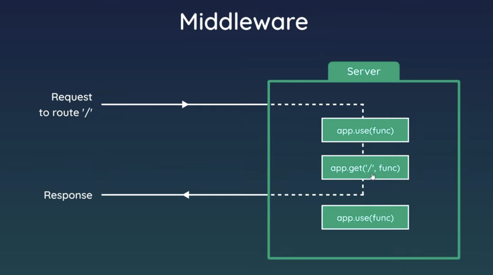
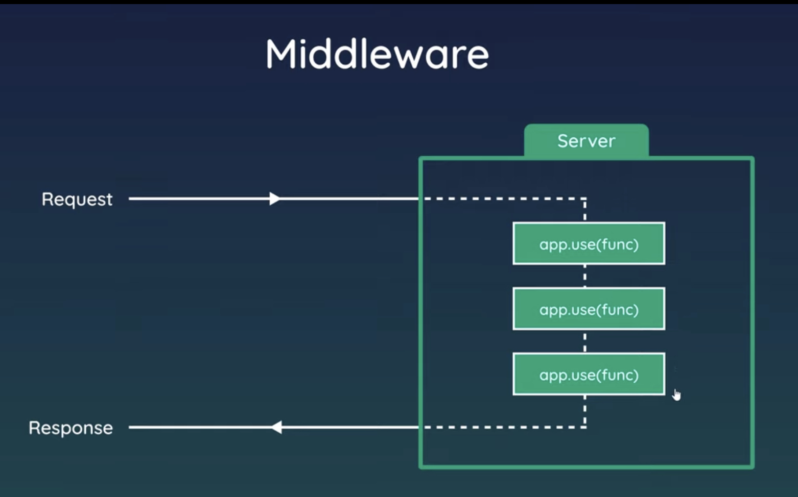

# Middleware

# Definition
A software layer between application and OS/network layer.  

Purpose: mask the complexity of the distributed system.  

Distributed system is a system that has different and complex elements which can perform variety of task or functionality.  

  


Middleware provides support to 
- Naming, directory service, location, replication
- Protocol handling, communication filure, QoS
- Synchronization, concurrency, transaction, storage
- Access control, authentication

The problem without a middleware
- Case of RPC (Remote Procedure Call)
	- Where?
	- Which RPC?
	- How to pass the argument?
	- How to call?
	- How to catch the return value?
	- What happened if there is an error?


With the RPC:
- Syntax transparency
- R/R interaction
- Distribution transparency
- Reliability


## Express Middleware
  

  


Function/program that runs between the server gets the request and the server sends the responses. Everything in express between requested by the user and response that received by the user is considered a middleware. So, express is a chain function of middleware.
```js
app.get('/users', (req, res) => {
	res.send('Users Page')
})
```
The code above, is a middleware between req and res (request and response) in express.js.


Express Middleware:
- User-defined middleware
	- Application-level middleware
	- Router-level middleware
	- Error-handling middleware
- Built-in middleware
	- express.static
	- express.json
	- express.urlencoded
- Third-party middleware
	- contoh: cookie-parser


## Sumber
- https://expressjs.com/en/guide/using-middleware.html


