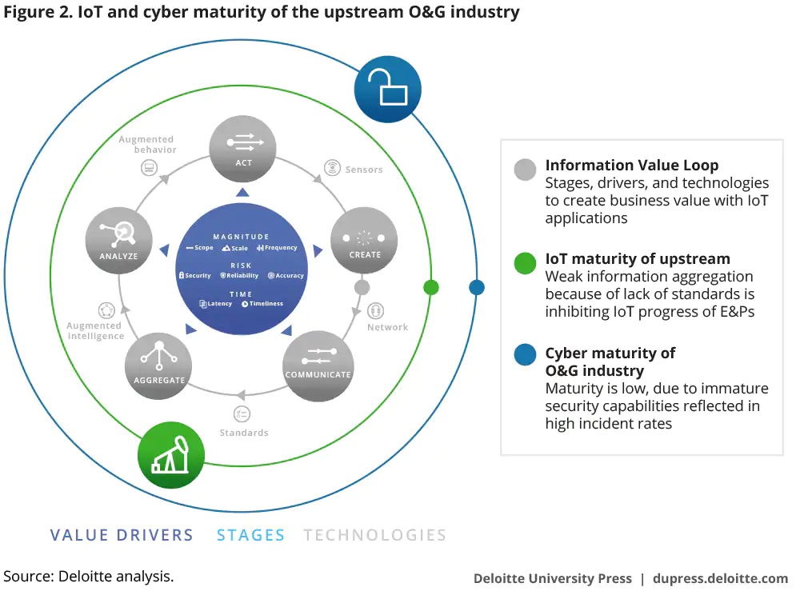
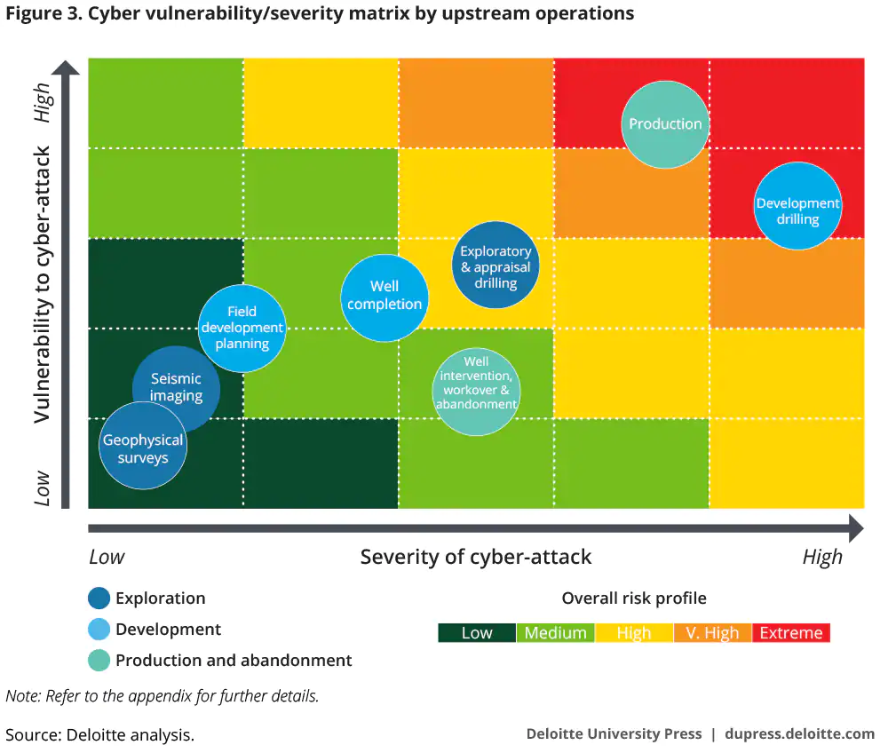

## Protecting the Connected Barrels
https://www2.deloitte.com/us/en/insights/industry/oil-and-gas/cybersecurity-in-oil-and-gas-upstream-sector.html?id=us:2el:3dc:dup3960:awa:dup

Motives:
1. Cyberterrorism
2. Industry espionage
3. Stealing field data

Upstream process:
high risk: drilling and production
low risk: seismic imaging
what could raise the risk digitization, e-store, feed seismic data into other disciplines. 

A holistic cyber risk management can:
1. mitigate cyber risk
2. enable all three of an upstream company's operational imperative
	1. safety of people
	2. reliably of operations
	3. creation of new value

2016 energy was the industry second most prone to cyber-attacks.

Attacks:
1. spyware
2. malware infecting production control systems
3. denial of service

Typical IT/OT architecture and cyber concerns of an O&G company

IoT technology strength and wakness:
the ability to create, communicate, aggregate, analyze, and act upon the data

Prioritization of cyber investments
Vulnerability of an upstream would be a function of the attack surface (i.e. number of vendors, users, and interfaces, or the number and type of ICS and operations); mode and flow of data (physical digital, unidirectional, bidirectional, or multidirectional)
; and the existing state of security controls in place.

Upstream stage (exploration, development, and production & abandonment) risk

Exploration
activity: 
operation 1: seismic imaging (low risk)
operation 2: geological and geophysical surveys (low risk)
operation 3: appraisal drilling (higher risk)

Development
within the value chain, this stage is particularly exposed to cyber incidents.
Development drilling -> higher drilling activity, expansive infrastructure and service both above and below the surface, complex ecosystem of engineering firms, equipment and material suppliers, drillers and service firms, partner, and consultants. 
the other two phases of development (field development planning and well completions) have relatively lower cyber risk.

Production and abandonment
O&G production operation ranks highest on upstream operations vulnerability, because it was not build for cybersecurity. Related to SCADA and ICS.

A company needs a holistic vigilant strategy, 
- securing every drilling asset is nearly impossible.
- additional security features may interfere with availability (it is important for time-sensitive decision making)
i.e. scanning on cloned SCADA or systems, anomaly detection

