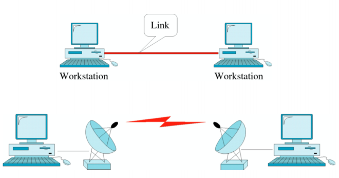
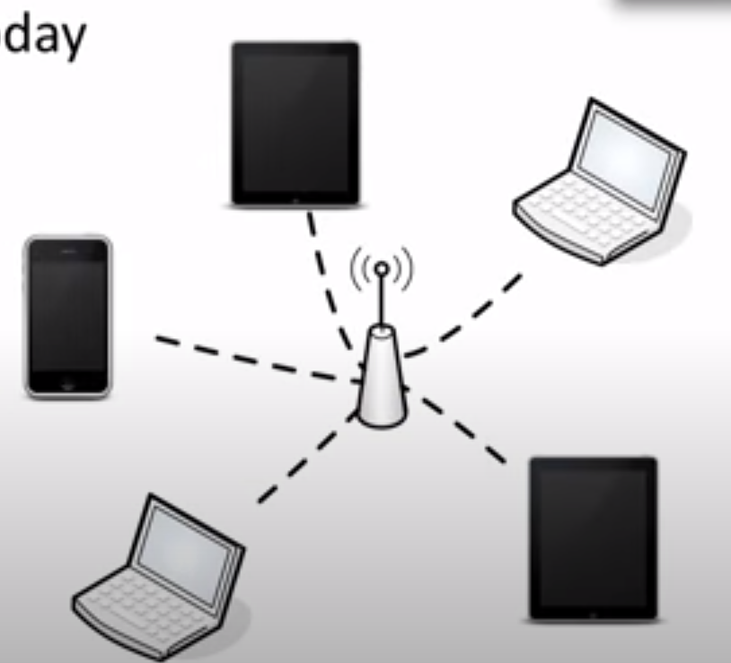
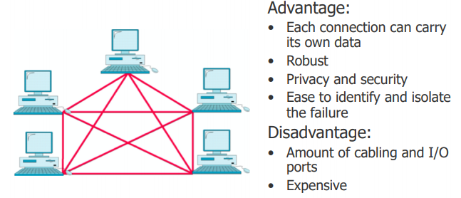
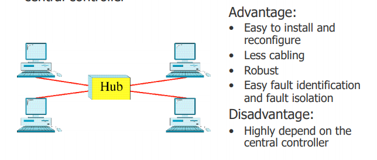
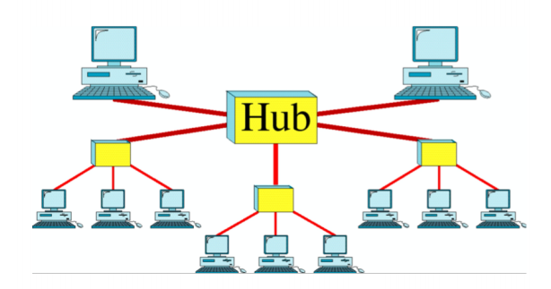
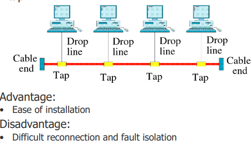
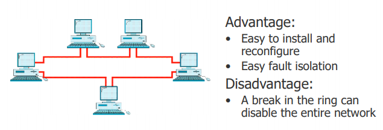
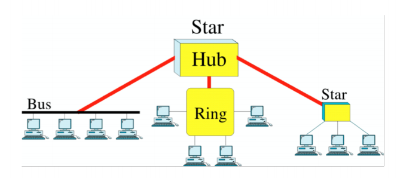

# Introduction to Data Communication

## Data Communication
Definition: The exchange of data among devices via transmission medium such as wire, cable, etc.

Components:
- **Message**: Text, numbers, pictures, audio, and video
- **Sender**: Computer, workstation, mobile phone, video camera
- **Receiver**: Computer, workstation, mobile phone, TV
- **Transmission Medium**: Cable, fiber-optic, radio-waves
- **Communication Protocol**: IPX/SPX, X.25, TCP/IP

## Data Flow
**Simplex**: Only one of the two devices on a link can transmit
i.e. Keyboard, monitor, scanner, printer.

**Half-Duplex**: Each station can both transmit and receive, but one at a time.
i.e. Walkie-talkies, CB radios

**Full-Duplex**: Both station can transmit and receive at the same time.

i.e. Telephone, network, Ethernet

## Network
A set of devices connected by communication link.  The nodes can be computer, printers, or many else.

### Network Criteria
#### Performance
**Throughput**: The rate of successful message delivery over a communication channel.
> Throughput and bandwidth are almost identical term of network performance. 
> 
> **Throughput**: how much data transferred from a source at any given time
> **Bandwidth**: how much data *could theoritically* to be transferred from a source at any given time.

**Delay or latency**: The time needed for a bit of data to travel across the network from the source toward the destination.
> You can use cmd/terminal to see the delay of communication by using ping command. Please note that, ping delay is delay between two-way communication
> ping delay = t*d* + t*s*
> td= time needed to reach destination.
> ts= time needed to reach your computer again.

#### Reliability
**Frequency of failure**
**Network robustness**

#### Security
**Protecting data**
**Implementing policies**

### Network Attribute
Consists of:
- Type of connection or line configuration
- Physical topology

#### Type of Connection or Line Configuration
**Point-to-point**: A device in one end and other device in other end, connected each other with nothing in the middle. i.e. old T1 or E-1 connection, p2p fiber optic connection, communication between satellite and antenna, adhoc network.

**Multipoint**: Connection in a shared channel or medium, i.e. wireless network. Multipoint connection doesn't necessarily imply that everybody can talk to everyone else. 

#### Physical Topology
**Mesh**
Every device has a dedicated point-to-point lin to every other device.

**Star**
Each device has a dedicated point-to-point link only to a central controller.

**Tree**

**Bus**
Nodes are connected to the bus cable by drop line and tap

**Ring**
Each device has a dedicated point-to-point connection with only two devices on either side of it.

**Hybrid**

### Categories of Networks
- Personal Area Networks
- Local Area Networks
- Wide Area Networks
- Metropolitan Area Networks

## Network Standards and Protocols
**Protocol** is a set of rules that govern data communications

Key elements of protocols
- Syntax: structure or format of data
- Semantics: each section of bits
- Timing: when data should be sent and how fast they can be send

**Standards** are guidelines to manufacturers, vendors, government agencies, and other service providers to ensure interconnectivity and interoperability. The establishment is divided by 
1. De facto (by fact)
2. De jure (by law)

Standard Organizations in Networking
1. International Organization for Standardization (ISO)
2. International Telecommunication Union - Telecommunication Standards Sector (ITU-T)
3. American National Standards Institute (ANSI)
4. Institute of Electrical and Electronics Engineers (IEEE)
5. Electronic Industries Association (EIA)

