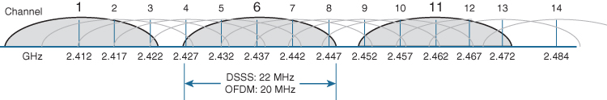
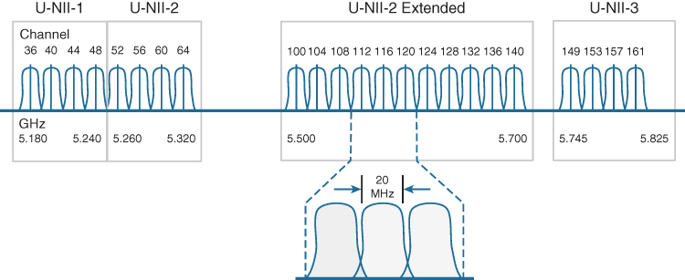

# 802.11 WLAN

## WLAN IEEE Standard

**Wireless 5 and 6**
**MIMO-OFDM**: Multiple transmission and receiving antennas to do multi-path propagation.

High Density Access Point = 100 concurrent connections, for enterprise solution.

## WLAN Physical Layer
Indonesia's regulation about indoor wireless
Pasal 7 
Base Station/Access Point untuk penggunaan indoor sebagaimana dimaksud dalam Pasal 5 ayat (2) huruf b dapat beroperasi pada Pita Frekuensi Radio: 
a. 2 400 – 2 483,5 MHz; 
b. 5 150 – 5 250 MHz; 
c. 5 250 – 5 350 MHz; atau 
d. 5 725 – 5 825 MHz.

**2.4 GHz Frequency**

You can use any frequency from 2.4 GHz to 2.4835 GHz
Best practice: use channel:
Number 1 : 2.401 GHz to 2.423 GHz, notated by 2.412 GHz (Center Frequency).
Number 6 : 2.426 GHz to 2.448 GHz, notated by 2.437 GHz (Center Frequency).
Number 11 : 2.451GHz to 2.473GHz, notated by 2.462 GHz (Center Frequency)
More Info:

**5GHz Frequency**

In Indonesia, best practice you can use channel no: 
Number 32, 5.150 GHz to 5.170 GHz, center frequency: 5.160 GHz.
Number 36, 5.170 GHz to 5.190 GHz, center frequency: 5.180 GHz.
Number 40, 5.190 GHz to 5.210 GHz, center frequency: 5.200 GHz.
Number 44, 5.210 GHz to 5.230 GHz, center frequency: 5.220 GHz.
Number 48, 5.230 GHz to 5.250 GHz, center frequency: 5.240 GHz.
Number 52, 5.250 GHz to 5.270 GHz, center frequency: 5.260 GHz.
Number 56, 5.270 GHz to 5.290 GHz, center frequency: 5.280 GHz.
Number 60, 5.290 GHz to 5.310 GHz, center frequency: 5.300 GHz.
Number 64, 5.310 GHz to 5.330 GHz, center frequency: 5.320 GHz.
Number 68, 5.330 GHz to 5.350 GHz, center frequency: 5.340 GHz.
Number 149, 5.735 GHz to 5.755 GHz, center frequency: 5.745 GHz.
Number 153, 5.755 GHz to 5.775 GHz, center frequency: 5.765 GHz.
Number 157, 5.775 GHz to 5.795 GHz, center frequency: 5.785 GHz.
Number 161, 5.795 GHz to 5.815 GHz, center frequency: 5.805 GHz.

So...
If you buy access point in Indonesia, you only may set the legal channel. Be careful if you buy access point from other countries. I.e. Zigbee can use 600MHz, 900MHz, and 2.4GHz, but in Indonesia, based on the regulation, you can only use 2.4GHz and 5GHz. 

## Hidden Node Problem

- C can't hear A
- It may start transmitting while A is also transmitting (A and C can't detect collision)
- Only receiver can help avoid collision.

## 4-Way Handshake

## WLAN Propagation Modelling
- Useful for understanding the phenomena
- Performance evaluation and planning
- For any type of wireless communication, the signal disperses with distance. Therefore, an antenna with a fixed area will receive less signal power the farther it is from the transmitting antenna.
- Isotropic antenna, free space loss is:

**WLAN Propagation**

**Multi-wall model**

Lw = Loss because attenuation of the wall
Lf = Loss because attenuation of the floor

**War Driving: Real Measurement**

## Wifi Signal Strength
Measured in dBm or decibel miliwatts
-30 dBm : Maximum achievable signal strength
-67 dBm : Minimum signal strength for application that require real time delivery
-70 dBm : Minimum signal strength for reliable packet delivery
-80 dBm : Unreliable
-90 dBm : Unusable

Converter: https://www.rapidtables.com/electric/dBm.html
## Reading Assignment: 
Chapter 17 of Stallings
Answer 5 questions in page 552 (Review Questions)